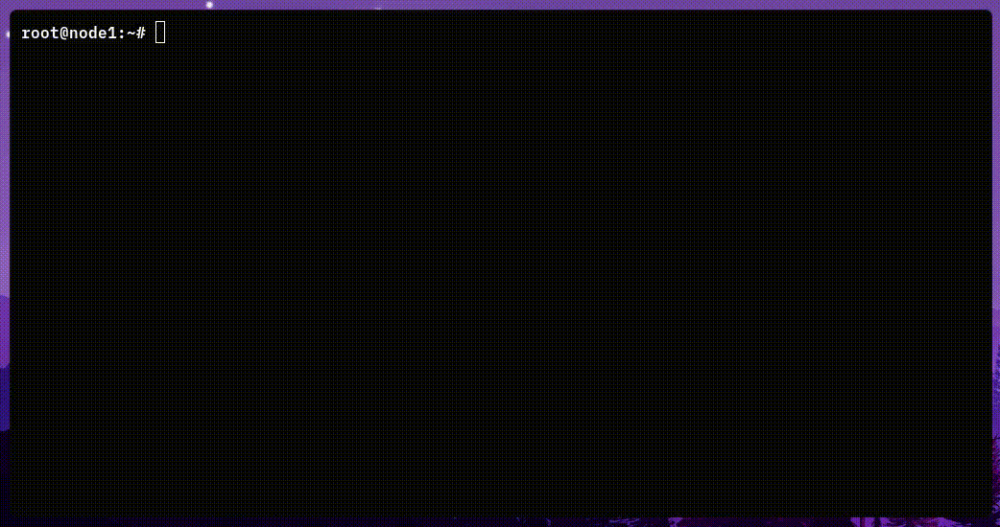

<div align="center">
  <a href="">
    
  </a>

  <p align="center">
	  A slick command-line utility to set up and manage your Nebula network
  </p>
</div>


<details>
  <summary>Table of Contents</summary>
  <ol>
    <li><a href="#what-is-nebula">What is Nebula?</a></li>
    <li><a href="#why-nebctl">Why nebctl?</a></li>
    <li>
      <a href="#getting-started">Getting Started</a>
      <ul>
        <li><a href="#dependencies">Dependencies</a></li>
        <li><a href="#installation">Installation</a></li>
      </ul>
    </li>
    <li><a href="#usage">Usage</a></li>
    <li><a href="#roadmap">Roadmap</a></li>
    <li><a href="#license">License</a></li>
  </ol>
</details>


## What is Nebula?

[Nebula](https://github.com/slackhq/nebula) is a scalable overlay networking tool with a focus on performance, simplicity and security. It lets you seamlessly connect computers anywhere in the world.

Nebula incorporates a number of existing concepts like encryption, security groups, certificates, and tunneling, and each of those individual pieces existed before Nebula in various forms. What makes Nebula different to existing offerings is that it brings all of these ideas together, resulting in a sum that is greater than its individual parts.


## Why nebctl?



TODO


## Getting Started

To get nebctl up and running, follow these steps.

### Dependencies
* pip
  ```sh
  # apt install python3-pip
  ```
  For other package managers, check https://pip.pypa.io/en/stable/installation/.

### Installation

1. Fetch and run the install script
```sh
$ sh -c "$(curl -sSfl https://gitlab.com/lgns-platform-team/nebula-control/-/raw/main/install.sh)"
```
2. Copy existing CA certificates, if any, to `/opt/nebctl/ca`. Otherwise, create one.
```sh
$ cd /opt/nebula-control/ca; nebula-cert ca -name "<name>" -duration 43834h
```


## Usage

```sh
$ nebctl COMMAND [-h] [--options]
```
### Available commands

| Command               | Description                                                            |
|:---------------------:| ---------------------------------------------------------------------- |
| **`add`**               | Set up a new remotely managed node on the network.                     |        
| **`remove`**            | Remove a node from network.                                            |
| **`status`**            | Show all nodes managed by the application.                             |
| **`edit`**              | Edit configuration of a remotely managed node.                         |
| **`sync`**              | Sync local configuration changes with a remotely managed node.         |
| **`groups`**            | Manage groups that the target node belongs to.                         |
| **`generate`**          | Generate distributable configuration files for a new node.             |
| **`import`**            | Import configuration files and set up the current host as a node.      |

### Command options and arguments
####  `add`
```sh
$ nebctl add [-h] --ip IP [--ssh-user SSH_USER] [--ssh-port SSH_PORT] 
             [--nebula-port NEBULA_PORT] [--lighthouse LIGHTHOUSE]
             [--ufw UFW] [--docker-ufw DOCKER_UFW] 
             [--groups GROUPS [GROUPS ...]]
             name
```
- `name`: Name of the client node on this network
- `--ip`: Public IP address of the client node
- `--lighthouse`: Whether or not the target client is a lighthouse (default: no)
- `--ssh-user`: SSH user on the client node (default: root)
- `--ssh-port`: Port on which the client node's SSH server is listening (default: 22)
- `--nebula-port`: Port on which the client node's Nebula service listens (default: 4242)
- `--ufw`: Whether or not to add firewall rules on the client (default: yes)
- `--docker-ufw`: Whether or not the host is exposing services with Docker (default: no)
- `--groups`: Nebula groups to which this node belongs to (default: [])

**NOTE**: The host's SSH key needs to be added to the target client node's authorized_keys list before attempting to add it to the network remotely via the `add` command. In case this is not possible, use the `generate` command to obtain configs for the node and distribute it manually.

To set up the host machine as a Nebula node, make sure its SSH key also exists in authorized_keys and pass in "localhost" as the argument for `--ip`,

####  `remove`
```sh
$ nebctl remove [-h] name
```
- `name`: Name of the client node on this network

#### `edit`
```sh
$ nebctl edit [-h] [--key KEY] name
```
- `name`: Name of the client node on this network
- `--key`: Configuration option key at which the editor opens (default: none)

#### `sync`
```sh
$ nebctl sync [-h] name
```
- `name`: Name of the client node on this network

#### `groups`
```sh
$ nebctl groups [-h] [--add ADD [ADD ...]] [--remove REMOVE [REMOVE ...]] name
```
- `name`: Name of the client node on this network
- `--add`: Groups to add this node to (default: [])
- `--remove`: Groups to remove this node from (default: [])

#### `generate`
```sh
$ nebctl generate [-h] [--groups GROUPS [GROUPS ...]] name
```
- `name`: Name of the client node on this network
- `--groups`: Nebula groups to which this node belongs to (default: [])

#### `import`
```sh
$ nebctl import [-h] config
```
- `config`: Path to the config.zip distributed by the admin


## Roadmap
- [x] Remote node management
- [x] Implement generation of distributable configurations
- [ ] Update configurations of all existing nodes upon new lighthouse addition
- [ ] Interface to edit nebctl settings

See [open issues](#) for a full list of proposed features (and known issues).


## License

Distributed under the MIT License. See `LICENSE.txt` for more information.
